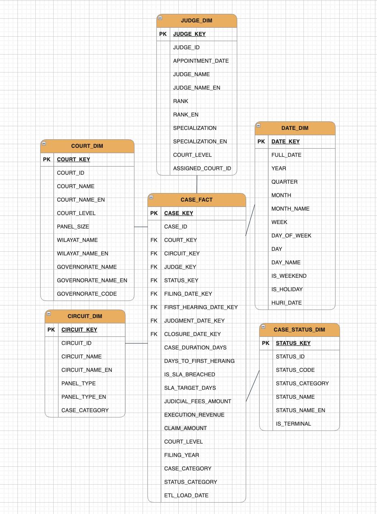
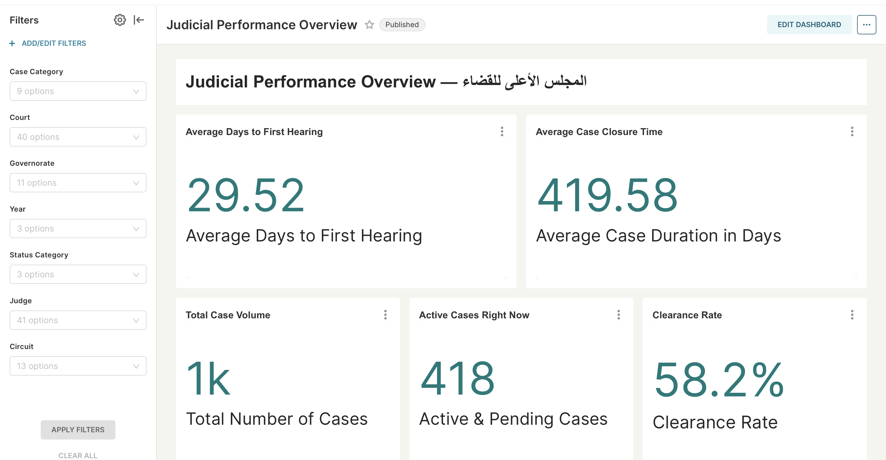
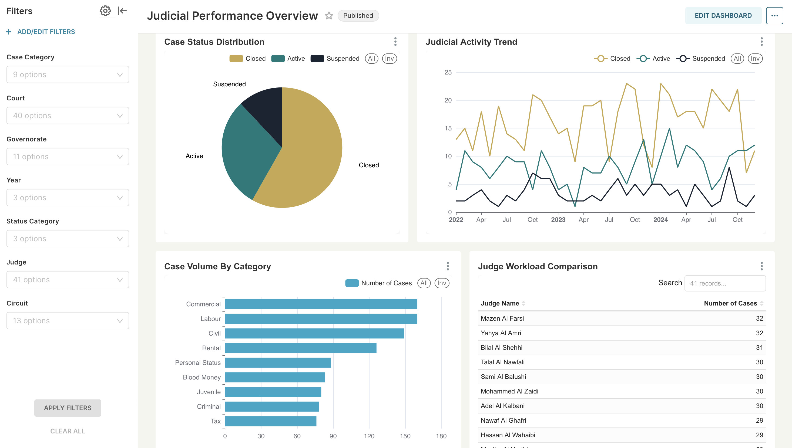
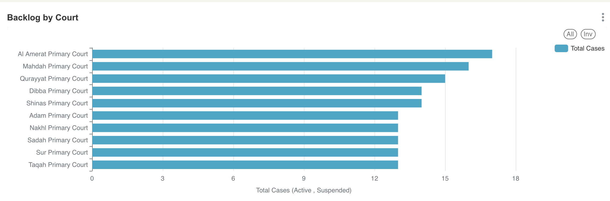
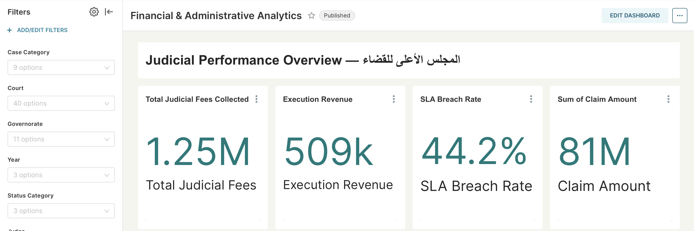
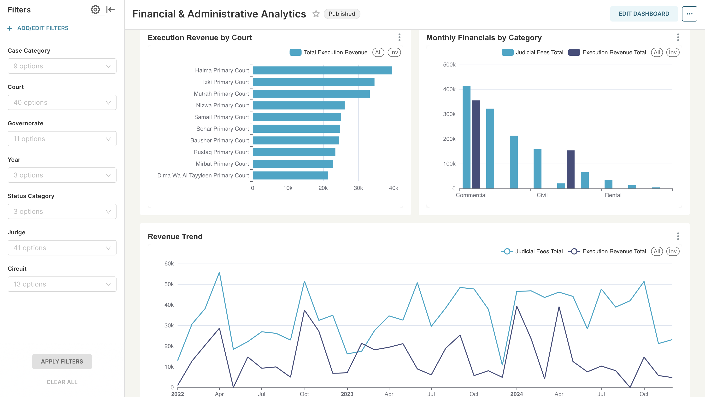
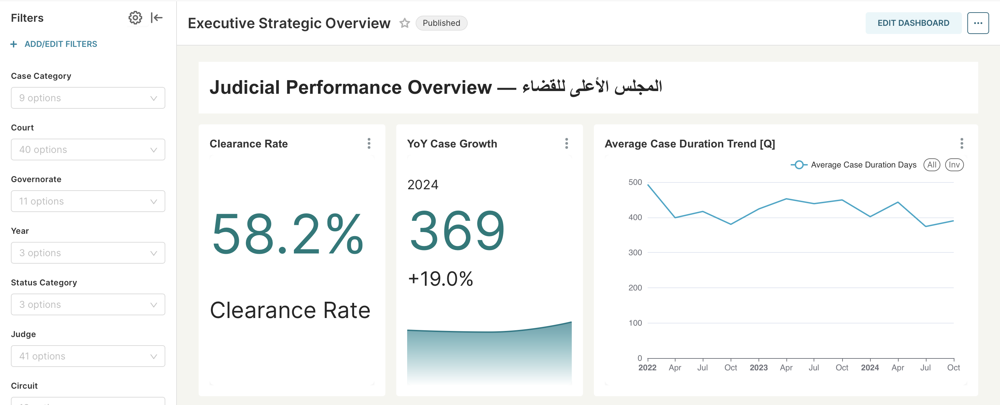
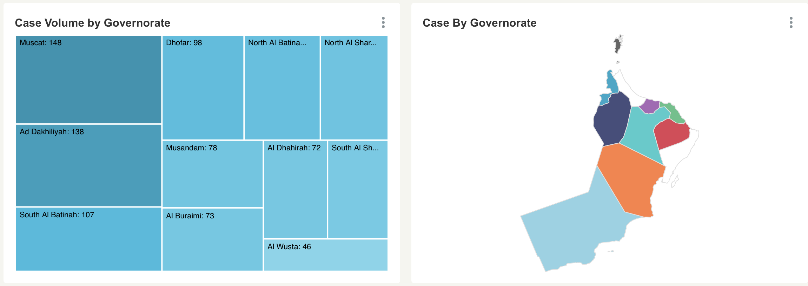
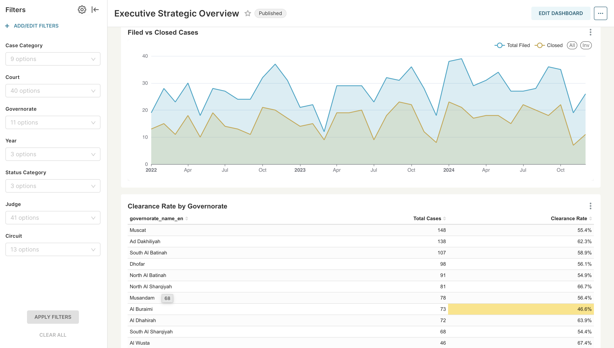

## Business & Technical Documentation

### Supreme Judicial Council — Sultanate of Oman

---
## Table of Contents

1. [Executive Summary](#1-executive-summary)
2. [Business Context](#2-business-context)
3. [System Architecture](#3-system-architecture)
4. [Business Process](#4-business-process)
5. [Data Model](#5-data-model)
6. [KPIs & Business Questions](#6-kpis--business-questions)
7. [Dashboards](#7-dashboards)
8. [Data Quality & Governance](#8-data-quality--governance)
9. [Historical Tracking](#9-historical-tracking)
10. [Assumptions & Limitations](#10-assumptions--limitations)
11. [Glossary](#11-glossary)
12. [Conclusion & Business Value](#12-conclusion--business-value)

---

## 1. Executive Summary

The Judicial Analytics Platform is a modern data warehouse and business intelligence solution designed for the Supreme Judicial Council (SJC) of Oman. The platform consolidates judicial case data from operational source systems into a unified analytical model, enabling consistent reporting, performance monitoring, and data-driven decision-making across the Omani judicial system.

The solution is built on an open-source lakehouse architecture — ingesting data from PostgreSQL through Apache NiFi into MinIO object storage, transforming it using dbt on the Trino query engine, and surfacing insights through Apache Superset dashboards. The result is a scalable, maintainable platform that gives operational managers, finance officers, and executive leadership a single source of truth for judicial performance.

Key outcomes delivered by this platform include real-time visibility into case backlog, SLA compliance monitoring across courts and case categories, judge workload analysis, and financial performance tracking — all structured around the specific needs of each stakeholder group.

---

## 2. Business Context

### 2.1 Organization

The Supreme Judicial Council (المجلس الأعلى للقضاء) is the highest judicial authority in the Sultanate of Oman, responsible for overseeing the administration and performance of the national court system. The judicial system follows a three-tier hierarchy:

|Level|Arabic|Count|Panel Composition|
|---|---|---|---|
|Supreme Court|المحكمة العليا|1|5 judges — cassation only|
|Courts of Appeal|محاكم الاستئناف|13|3 judges — reviews First Instance judgments|
|Courts of First Instance|المحاكم الابتدائية|40|1 or 3 judges — new case filings|

Each Court contains multiple circuits (دوائر), which define the type of cases handled and the panel composition. Circuits range from Personal Status and Civil to Criminal, Commercial, Labour, Rental, Tax, Juvenile, and Blood Money.

### 2.2 Problem Statement

Prior to this platform, judicial performance data was fragmented across operational systems with no unified analytical view. This created three core challenges:

- **No performance visibility:** Court managers had no consistent mechanism to monitor case volumes, backlog, or resolution times across courts and governorates
- **Manual reporting:** KPI reporting required manual extraction and aggregation from source systems, leading to delays and inconsistencies across reporting periods
- **No SLA tracking:** There was no systematic way to identify cases exceeding defined resolution time thresholds by category or court

### 2.3 Objectives

The platform is designed to achieve the following objectives:

- Standardize case lifecycle tracking across all courts, circuits, and governorates
- Monitor case resolution efficiency and SLA compliance continuously
- Evaluate workload distribution across judges and courts to support fair case assignment
- Enable historical trend analysis for operational planning and capacity forecasting
- Provide financial visibility into judicial fee collection and execution revenue
- Support strategic decision-making through executive-level dashboards aligned to stakeholder needs

---

## 3. System Architecture

### 3.1 Pipeline Overview

The platform follows a modern open lakehouse architecture with five distinct layers, each serving a specific purpose in the data journey from source to insight.

```
┌─────────────────────┐
│   PostgreSQL 15     │  ← Source OLTP (judicial_db)
│   Normalized        │    Cases, Courts, Judges, Circuits
│   Case Management   │    Hearings, Status History
└────────┬────────────┘
         │
         ▼  (Extract via JDBC)
┌─────────────────────┐
│   Apache NiFi 2.8   │  ← Ingestion Pipeline
│                     │    Reads from PostgreSQL
│                     │    Writes Parquet to MinIO
└────────┬────────────┘
         │
         ▼  (Parquet files)
┌─────────────────────┐
│   MinIO             │  ← Object Storage (S3-compatible)
│   hive.landing      │    Raw Parquet — one folder per table
│                     │    Immutable landing zone
└────────┬────────────┘
         │
         ▼  (Hive Metastore registers table definitions)
┌─────────────────────┐
│   Trino 435         │  ← Distributed Query Engine
│   on Iceberg        │    Runs dbt-compiled SQL
│                     │    ACID transactions, time travel
└────────┬────────────┘
         │
         ▼  (dbt transformations)
┌─────────────────────┐
│   dbt 1.11          │  ← Transformation Layer
│   staging →         │    Cleans, casts, renames
│   intermediate →    │    Joins, enriches, computes
│   marts             │    Final star schema
└────────┬────────────┘
         │
         ▼  (reads iceberg.marts)
┌─────────────────────┐
│   Apache Superset   │  ← Visualization Layer
│   3.1.0             │    Three role-based dashboards
│                     │    Native filters, cross-filtering
└─────────────────────┘
```

### 3.2 Technology Stack

| Component       | Technology            | Role                                             |
| --------------- | --------------------- | ------------------------------------------------ |
| Source Database | PostgreSQL            | Normalized OLTP — operational case data          |
| Ingestion       | Apache NiFi           | Data pipeline from PostgreSQL to MinIO           |
| Object Storage  | MinIO                 | S3-compatible lakehouse storage                  |
| Table Format    | Apache Iceberg        | ACID transactions, schema evolution, time travel |
| Metastore       | Apache Hive Metastore | Table metadata and schema management             |
| Query Engine    | Trino                 | Distributed SQL execution on Iceberg tables      |
| Transformation  | dbt                   | Modular, testable data transformations           |
| dbt Package     | dbt_utils             | Surrogate key generation, date spine             |
| Visualization   | Apache Superset       | BI dashboards and self-service analytics         |
| Orchestration   | Docker Compose        | Container lifecycle management                   |

### 3.3 Storage Schema Layout

|Schema|Catalog|Layer|Purpose|
|---|---|---|---|
|`landing`|`hive`|Raw|Parquet files written by NiFi — immutable raw zone|
|`staging`|`iceberg`|Staging|Cleaned views — one per source table|
|`intermediate`|`iceberg`|Intermediate|Joined and enriched views — not exposed to BI|
|`marts`|`iceberg`|Marts|Final star schema — queried by Superset|
|`snapshots`|`iceberg`|Snapshots|SCD Type 2 historical tracking|

### 3.4 dbt Project Structure

The dbt project follows a layered architecture with clear separation between transformation stages:

```
sjc_dwh/
├── models/
│   ├── staging/              # view — one model per source table
│   │   ├── stg_cases.sql
│   │   ├── stg_courts.sql
│   │   ├── stg_circuits.sql
│   │   ├── stg_judges.sql
│   │   ├── stg_hearings.sql
│   │   ├── stg_case_status_history.sql
│   │   ├── stg_judge_court_assignment.sql
│   │   └── _stg_sources.yml
│   ├── intermediate/         # view — joins, enrichment, computed fields
│   │   ├── int_court_enriched.sql
│   │   ├── int_judge_enriched.sql
│   │   ├── int_case_enriched.sql
│   │   ├── int_date_spine.sql
│   │   └── _int_models.yml
│   └── marts/                # table — final analytical layer
│       ├── dim_court.sql
│       ├── dim_circuit.sql
│       ├── dim_judge.sql
│       ├── dim_date.sql
│       ├── dim_case_status.sql
│       ├── fact_cases.sql
│       └── _marts_models.yml
├── seeds/                    # static reference CSVs
│   ├── governorates.csv
│   ├── wilayat.csv
│   └── case_statuses.csv
├── snapshots/
│   └── cases_snapshot.sql
├── tests/                    # singular data quality tests
│   ├── assert_closed_case_has_dates.sql
│   ├── assert_closure_date_after_filing_date.sql
│   ├── assert_judge_single_court.sql
│   └── assert_no_cross_level_assignment.sql
└── macros/
    └── generate_schema_name.sql
```

**Materialization strategy:**

|Layer|Materialization|Reason|
|---|---|---|
|Staging|View|No storage cost — pipeline internal only|
|Intermediate|View|Pipeline internal — never queried by BI|
|Marts — dimensions|Table|Small, queried constantly by Superset|
|Marts — fact|Table (→ Incremental)|Switch to incremental post-development|
|Snapshots|SCD Table|Managed by dbt snapshot command|

---

## 4. Business Process

The judicial case lifecycle follows a structured progression from initiation to resolution. This lifecycle is directly reflected in the analytical data model, where each case is represented as a single record in the fact table.

### 4.1 Case Lifecycle Stages

```
1. CASE FILING
   └─ Case registered at a Court of First Instance
   └─ Attributes captured: court, circuit, filing date, parties

2. CASE ASSIGNMENT
   └─ Circuit determined by case type (Civil, Criminal, Commercial...)
   └─ Judge assigned based on specialization and circuit
   └─ Panel type set: Single (فردي) or Panel (ثلاثي)

3. HEARINGS
   └─ One or more hearings scheduled and conducted
   └─ Each hearing recorded with type, outcome, and next date
   └─ Case may be adjourned or suspended between hearings

4. JUDGMENT
   └─ Final ruling issued by assigned judge or panel
   └─ Judgment date recorded

5. CASE CLOSURE
   └─ Terminal status assigned: JUDGED / SETTLED / WITHDRAWN / DISMISSED
   └─ Closure date recorded
   └─ Case duration calculated: closure_date − filing_date
```

### 4.2 Case Status Model

Cases move through a defined set of statuses grouped into three categories:

|Category|Statuses|Meaning|
|---|---|---|
|**Active**|FILED, SCHEDULED, IN_PROGRESS|Case is progressing normally|
|**Suspended**|ADJOURNED, PENDING_DOC|Case is paused — requires action|
|**Closed**|JUDGED, SETTLED, WITHDRAWN, DISMISSED|Case is complete — no further transitions|

Terminal statuses (Closed category) require both `judgment_date` and `closure_date` to be populated. This is enforced by a data quality test.

### 4.3 Appeal Pathway

If a party is unsatisfied with a First Instance judgment, they may appeal. The appeal case is filed at the corresponding Court of Appeal. At this stage, only Appeal-level judges are assigned — this hierarchy is enforced by a singular dbt test. If the appeal judgment is further challenged, the case escalates to the Supreme Court for cassation review, where only legal application is examined, not facts.

---

## 5. Data Model

### 5.1 Overview

The analytical layer follows a star schema design centered on a single fact table (`fact_cases`) surrounded by five dimension tables. The grain is one row per case.



### 5.2 Fact Table: `fact_cases`

**Grain:** One row per judicial case.

| Column                   | Description                                        |
| ------------------------ | -------------------------------------------------- |
| `case_key`               | Surrogate primary key — hash of case_number        |
| `case_number`            | Degenerate dimension — human-readable case ID      |
| `court_key`              | FK → dim_court                                     |
| `circuit_key`            | FK → dim_circuit                                   |
| `judge_key`              | FK → dim_judge (nullable — unassigned cases)       |
| `status_key`             | FK → dim_case_status                               |
| `filing_date_key`        | FK → dim_date (role: Filing Date)                  |
| `first_hearing_date_key` | FK → dim_date (role: First Hearing Date)           |
| `judgment_date_key`      | FK → dim_date (role: Judgment Date)                |
| `closure_date_key`       | FK → dim_date (role: Closure Date)                 |
| `case_duration_days`     | Closure − Filing in days. NULL for open cases      |
| `days_to_first_hearing`  | First hearing − Filing. Scheduling efficiency      |
| `is_sla_breached`        | NULL (open), true/false (closed) vs SLA target     |
| `sla_target_days`        | Policy target per case_category                    |
| `judicial_fees_amount`   | Court fees collected in OMR                        |
| `execution_revenue`      | Enforcement revenue — Criminal/Commercial only     |
| `claim_amount`           | Original plaintiff claim in OMR                    |
| `court_level`            | Partition key — Supreme / Appeal / First Instance  |
| `filing_year`            | Partition key — extracted from filing_date         |
| `case_category`          | Denormalized — Civil / Criminal / Commercial / ... |
| `status_category`        | Denormalized — Active / Suspended / Closed         |
| `etl_load_date`          | Date this row was last built by dbt                |

**Date Role-Playing:** All four date keys reference the same `dim_date` table. In Superset, virtual datasets are created with explicit joins to `dim_date` on each key separately, enabling time-based analysis by filing date, hearing date, judgment date, or closure date independently.

### 5.3 Dimension Tables

#### dim_court

Flattens the full geographic hierarchy: Court → Wilayat → Governorate.

|Column|Description|
|---|---|
|`court_key`|Surrogate PK|
|`court_id`|Natural key from source|
|`court_name` / `court_name_en`|Bilingual court name|
|`court_level`|Supreme / Appeal / First Instance|
|`panel_size`|5 (Supreme), 3 (Appeal), 1 (First Instance)|
|`wilayat_name` / `wilayat_name_en`|District — may be NULL for Supreme/Appeal|
|`governorate_name` / `governorate_name_en`|Governorate (Arabic + English)|
|`governorate_code`|ISO-style code e.g. MCT, DFR|

#### dim_circuit

The primary case-type analytical axis. Each circuit belongs to a court and defines what types of cases it handles.

|Column|Description|
|---|---|
|`circuit_key`|Surrogate PK|
|`circuit_name` / `circuit_name_en`|Bilingual circuit name e.g. فردي مدني / Civil - Single|
|`panel_type` / `panel_type_en`|فردي/Single, ثلاثي/Panel, خماسي/Full Bench|
|`case_category`|Civil, Criminal, Commercial, Labour, Personal Status, Rental, Tax, Juvenile, Blood Money|

#### dim_judge

|Column|Description|
|---|---|
|`judge_key`|Surrogate PK|
|`judge_name` / `judge_name_en`|Bilingual full name|
|`appointment_date`|Date of judicial appointment|
|`rank` / `rank_en`|Full Omani judicial rank title|
|`specialization` / `specialization_en`|Nullable — not all judges specialize|
|`court_level`|Enforces hierarchy: Supreme / Appeal / First Instance|
|`assigned_court_id`|Current court assignment|

#### dim_date

Generated using `dbt_utils.date_spine` covering 2020–2030. Oman weekend = Friday and Saturday.

|Column|Description|
|---|---|
|`date_key`|Integer in YYYYMMDD format — matches FK format in fact_cases|
|`full_date`|DATE value|
|`day`, `day_of_week`, `day_name`|Day attributes|
|`week`, `month`, `month_name`, `quarter`, `year`|Calendar hierarchy|
|`is_weekend`|True for Friday and Saturday|
|`is_holiday`|Placeholder — populate from official Omani calendar|
|`hijri_year`|Placeholder — populate with Hijri conversion|

#### dim_case_status

|Column|Description|
|---|---|
|`status_key`|Surrogate PK|
|`status_code`|FILED, SCHEDULED, IN_PROGRESS, ADJOURNED, PENDING_DOC, JUDGED, SETTLED, WITHDRAWN, DISMISSED|
|`status_name` / `status_name_en`|Bilingual display name|
|`status_category`|Active / Suspended / Closed|
|`is_terminal`|True if no further status transitions expected|

### 5.4 Seeds

Three reference tables that never change operationally are version-controlled as CSV files in the dbt `seeds/` directory:

| Seed                | Purpose                                           |
| ------------------- | ------------------------------------------------- |
| `governorates.csv`  | All Omani governorates with AR/EN names and codes |
| `wilayat.csv`       | All wilayat (districts) per governorate           |
| `case_statuses.csv` | Status codes with category and terminal flag      |

### 5.5 Intermediate Models

|Model|Inputs|Key Transformations|
|---|---|---|
|`int_court_enriched`|stg_courts + wilayat seed + governorates seed|Flattens court→wilayat→governorate hierarchy. Wilayat join is LEFT — Supreme courts have no wilayat.|
|`int_judge_enriched`|stg_judges + stg_judge_court_assignment|Joins judges to their current assignment (assigned_to IS NULL or empty).|
|`int_case_enriched`|stg_cases + stg_circuits + stg_courts + stg_judges + case_statuses seed|Main pre-fact model. Converts dates to YYYYMMDD integer keys. Computes case_duration_days, days_to_first_hearing, is_sla_breached using inline SLA targets CTE.|
|`int_date_spine`|dbt_utils.date_spine macro|Generates every calendar date 2020–2030 with all attributes.|

---

## 6. KPIs & Business Questions

### 6.1 Business Questions

The platform is designed to answer the following key business questions:

- What is the total case volume across courts, categories, and time periods?
- How are cases distributed across lifecycle statuses (Active, Closed, Suspended), and how does this change over time?
- What is the average case resolution time, and how does it vary by court, case category, and region?
- Which courts have the highest backlog of pending or suspended cases, indicating potential capacity constraints?
- How is workload distributed across judges, and are there imbalances that may impact performance or fairness?
- Which courts or judges are exceeding defined SLA thresholds, and where are delays most concentrated?
- How do case trends evolve over time (monthly, quarterly, yearly), and what patterns can be observed in filings and closures?
- Where are potential bottlenecks in judicial capacity, and which areas require operational optimization?

### 6.2 KPI Definitions


| KPI                           | Definition                                                                  | Calculation                                                |
| ----------------------------- | --------------------------------------------------------------------------- | ---------------------------------------------------------- |
| **Case Volume**               | Total number of cases analyzed across courts, categories, and time periods  | `COUNT(case_key)`                                          |
| **Case Status Distribution**  | Proportion of cases across Active, Suspended, and Closed stages             | `COUNT(*) GROUP BY status_category`                        |
| **Average Case Closure Time** | Mean duration in days from filing to closure for closed cases               | `AVG(case_duration_days)` WHERE closed                     |
| **Days to First Hearing**     | Average days from filing to first scheduled hearing                         | `AVG(days_to_first_hearing)`                               |
| **Judge Workload**            | Number of cases assigned per judge                                          | `COUNT(case_key) GROUP BY judge_key`                       |
| **Backlog Volume**            | Number of cases that remain Active or Suspended                             | `COUNT(*) WHERE status_category IN ('Active','Suspended')` |
| **SLA Breach Rate**           | Percentage of closed cases exceeding resolution time thresholds by category | `SUM(is_sla_breached) / COUNT(*)`WHERE closed              |
| **Clearance Rate**            | Ratio of closed cases to total cases                                        | `SUM(Closed) / COUNT(*)`                                   |
| **Execution Revenue**         | Total revenue from enforcement of judgments                                 | `SUM(execution_revenue)`                                   |
| **Judicial Fees Collected**   | Total court fees collected from case filings                                | `SUM(judicial_fees_amount)`                                |

### 6.3 SLA Targets by Case Category

SLA targets are defined in the `int_case_enriched` intermediate model. A case is flagged as `is_sla_breached = TRUE` when `case_duration_days > sla_target_days` for its category.

|Case Category|Target Days|Rationale|
|---|---|---|
|Criminal|180|Urgency of criminal proceedings|
|Labour|120|Employment disputes require fast resolution|
|Juvenile|90|Juvenile cases have highest priority|
|Commercial|270|Commercial disputes may require expert review|
|Rental|180|Housing disputes are time-sensitive|
|Civil|365|Standard civil proceedings|
|Personal Status|365|Family law requires careful deliberation|
|Tax|365|Complex financial investigations|
|Blood Money|365|Requires thorough judicial process|
|Administrative|365|Administrative review proceedings|

### 6.4 Time-Based Analysis

All KPIs support analysis across the following time granularities through the `dim_date` dimension and Superset's native time grain controls:

- **Weekly** — operational monitoring
- **Monthly** — standard reporting cycle
- **Quarterly** — performance review periods
- **Bi-yearly** — half-year strategic reviews
- **Yearly** — annual performance benchmarking

---

## 7. Dashboards

The platform delivers three role-based dashboards, each designed for a specific audience and business question. All dashboards are built in Apache Superset and connected to the `iceberg.marts` schema via Trino.

### 7.1 Dashboard 1 — Operational Court Performance

**Audience:** Court managers and operations staff

**Business Question:** What is happening in courts today, and where are the bottlenecks?

**Filters available:** Governorate, Court, Case Category, Judge, Circuit, Year, Status Category

| Chart                     | Type        | Metric                                                             | Purpose                                |
| ------------------------- | ----------- | ------------------------------------------------------------------ | -------------------------------------- |
| Total Cases Filed         | Big Number  | `COUNT(case_key)`                                                  | Overall system volume                  |
| Active Cases Right Now    | Big Number  | `COUNT` filtered to Active/Suspended                               | Current workload                       |
| Avg Days to First Hearing | Big Number  | `AVG(days_to_first_hearing)`                                       | Scheduling efficiency                  |
| Avg Case Closure Time     | Big Number  | `AVG(case_duration_days)` on closed                                | Processing speed                       |
| Clearance Rate            | Big Number  | `SUM CASE WHEN status_category = 'Closed'` <br>`/ COUNT(case_key)` | Ability to keep up with incoming cases |
| Case Status Distribution  | Donut Chart | `COUNT` by status_category                                         | Pipeline health overview               |
| Judicial Activity Trend   | Line Chart  | Filed vs Closed by month                                           | Backlog growth detection               |
| Case Volume by Category   | Bar Chart   | `COUNT` by case_category                                           | Case type distribution                 |
| Backlog by Court          | Bar Chart   | `COUNT` Active/Suspended by court                                  | Court capacity pressure                |
| Judge Workload            | Table       | `COUNT(CASE)` by judge_name_en                                     | Workload imbalance detection           |




### 7.2 Dashboard 2 — Financial & Administrative Analytics

**Audience:** Finance officers and administrative leadership

**Business Question:** Is the court system financially healthy and meeting its compliance obligations?

**Filters available:** Year, Case Category, Court, Governorate, Status Category

|Chart|Type|Metric|Purpose|
|---|---|---|---|
|Total Judicial Fees|Big Number|`SUM(judicial_fees_amount)`|Revenue collected|
|Execution Revenue|Big Number|`SUM(execution_revenue)`|Enforcement revenue|
|SLA Breach Rate|Big Number|`SUM(is_sla_breached) / COUNT(*)`|Compliance rate|
|Total Claim Amount|Big Number|`SUM(claim_amount)`|Financial stakes handled|
|Revenue Trend|Line Chart|Fees + execution over time|Revenue trajectory|
|Execution Revenue by Court|Bar Chart|`SUM(execution_revenue)` by court|Top performing courts|
|Monthly Financials by Category|Bar Chart|Fees + execution by case_category|Category revenue breakdown|




### 7.3 Dashboard 3 — Executive Strategic Overview

**Audience:** SJC leadership and ministry-level stakeholders

**Business Question:** Is the judicial system improving over time, and are resources distributed fairly?

**Filters available:** Year, Governorate, Court, Case Category, Status Category, Judge, Circuit

|Chart|Type|Metric|Purpose|
|---|---|---|---|
|YoY Case Growth|Big Number with trend|`COUNT` vs 1 year ago|System demand trajectory|
|Clearance Rate|Big Number|Closed / Total|Overall system health|
|Avg Case Duration Trend|Line Chart|`AVG(case_duration_days)` by quarter|Is the system getting faster?|
|Filed vs Closed Gap|Area Chart|Filed vs Closed by month|Backlog growth or reduction|
|Clearance Rate by Governorate|Table|Clearance rate per governorate|Regional equity analysis|
|Case Volume by Governorate|Map / Treemap|`COUNT` per governorate|Geographic demand distribution|






---

## 8. Data Quality & Governance

Data quality and governance are enforced using dbt generic tests defined in YAML files and singular tests written as SQL assertions. All tests follow the dbt convention: a test passes when it returns zero rows.

### 8.1 Generic Tests

Generic tests are defined in `models/marts/_marts_models.yml` and applied to all dimension and fact tables.

|Test Type|Applied To|What It Enforces|
|---|---|---|
|`unique` + `not_null`|All surrogate keys: court_key, circuit_key, judge_key, status_key, date_key, case_key|Entity integrity — no duplicate or missing PKs|
|`not_null`|court_key, circuit_key, status_key, filing_date_key in fact_cases|Referential completeness — no orphaned fact rows|
|`accepted_values`|court_level (3 values), status_category (3 values), panel_type (3 values)|Domain integrity — controlled vocabulary enforcement|
|`relationships`|court_key, circuit_key, status_key, filing_date_key in fact_cases|Referential integrity — all FKs map to valid dimension records|

### 8.2 Singular Tests

Four custom singular tests enforce business rules that cannot be expressed as generic tests:

|Test|Business Rule Enforced|
|---|---|
|`assert_closed_case_has_dates`|Any case with a terminal status (JUDGED, SETTLED, WITHDRAWN, DISMISSED) must have both `judgment_date` and `closure_date` populated. A closed case without these dates represents incomplete data.|
|`assert_closure_date_after_filing_date`|If a case has a `closure_date`, it must be on or after the `filing_date`. A closure date before the filing date is logically impossible and indicates a pipeline error.|
|`assert_judge_single_court`|A judge must have at most one active court assignment at any time (`assigned_to IS NULL`). Multiple concurrent active assignments indicate a data integrity violation.|
|`assert_no_cross_level_assignment`|No case filed at a First Instance court may be assigned to an Appeal or Supreme Court judge. This enforces the judicial hierarchy rule that new filings always go to First Instance judges.|

### 8.3 Staging Layer Controls

Additional data quality controls are applied at the staging layer before data reaches the analytical layer:

- **Explicit type casting:** All date columns arrive as VARCHAR from the NiFi/Parquet landing and are explicitly cast to DATE in staging models using `TRY_CAST` to avoid pipeline failures on malformed values
- **Consistent column naming:** All columns are renamed to a consistent snake_case convention across all staging models
- **Bilingual field preservation:** Arabic and English name fields are preserved and passed through to dimensions without modification to support bilingual reporting
- **NULL handling:** Financial columns (`execution_revenue`, `claim_amount`) are allowed to be NULL where not applicable — NULLs are handled in metric calculations using `COALESCE` or `NULLIF` in Superset

---

## 9. Historical Tracking

Historical changes are captured using a dbt snapshot model that implements Slowly Changing Dimension (SCD) Type 2 behavior.

### 9.1 Snapshot: `cases_snapshot`

|Property|Value|
|---|---|
|Strategy|Timestamp — uses `cases.updated_at`|
|Unique key|`case_id`|
|Target schema|`iceberg.snapshots`|
|Added columns|`dbt_scd_id`, `dbt_updated_at`, `dbt_valid_from`, `dbt_valid_to`|

When a case record changes in the source system (e.g., status changes from IN_PROGRESS to JUDGED, or a judge is reassigned), the snapshot captures both the old and new state:

- The previous record receives a `dbt_valid_to` timestamp
- A new record is inserted with `dbt_valid_from` set to the change time and `dbt_valid_to` as NULL (indicating current)

### 9.2 Analytical Benefits

|Use Case|How Snapshot Enables It|
|---|---|
|Point-in-time reporting|Query `WHERE dbt_valid_from <= target_date AND (dbt_valid_to > target_date OR dbt_valid_to IS NULL)`|
|Status transition analysis|Compare consecutive records for the same `case_id` to identify lifecycle progressions and delays|
|Historical backlog calculation|Count open cases as they existed at any past date, not just today|
|Judge reassignment tracking|Identify cases where `judge_id` changed between snapshot versions|

### 9.3 Running Snapshots

```bash
dbt snapshot                    # capture current changes
dbt snapshot --select cases_snapshot   # target snapshot only
```

Snapshots should be run after each `dbt run` execution to keep historical records current.

---

## 10. Assumptions & Limitations

### 10.1 Assumptions

- All 40 verified Courts of First Instance are included. The SJC lists 44 total but only 40 can be verified by name from public sources. The remaining 4 should be added when the full official list is obtained directly from SJC.
- The 2 additional Appeal courts beyond the 11 governorate-level courts are included as pending confirmation. The SJC official page lists 13 Courts of Appeal.
- Judge rank hierarchy is based on publicly available information about the Omani judicial system (Royal Decree 90/99). This should be verified against the official Judicial Authority Law before production use.
- SLA targets are policy assumptions based on case category complexity. These must be confirmed and adjusted based on official SJC policy documents before production deployment.
- The demo dataset contains 500 synthetic cases generated with Python using realistic Omani names, courts, circuits, and judicial fee ranges. All data is fictional and for demonstration purposes only.
- The Oman weekend is defined as Friday and Saturday in the `dim_date` model, consistent with the Omani Labor Law.
---

## 11. Glossary

|Term|Arabic|Definition|
|---|---|---|
|Case (Qadiyya)|قضية|A legal matter filed before a court for adjudication|
|Court of First Instance|محكمة ابتدائية|The first level of the judicial hierarchy — where a case is initially filed and heard|
|Court of Appeal|محكمة استئناف|The second level — reviews judgments from First Instance courts for legal or procedural errors|
|Supreme Court|المحكمة العليا|The highest court — reviews Appeal judgments on points of law only|
|Circuit (Da'ira)|دائرة|A specialized division within a court handling a specific case category|
|Panel Type|نوع الدائرة|Single judge (فردي) or three-judge panel (ثلاثي) or five-judge full bench (خماسي)|
|Governorate (Muhafazat)|محافظة|The highest administrative division in Oman — 11 governorates|
|Wilayat|ولاية|District-level administrative subdivision within a governorate|
|Filing Date|تاريخ الرفع|The date a case is formally submitted to the court|
|Judgment Date|تاريخ الحكم|The date the court issues its final ruling|
|Closure Date|تاريخ الإغلاق|The date a case is formally closed in the system|
|SLA (Service Level Agreement)|اتفاقية مستوى الخدمة|The defined maximum number of days within which a case should be resolved by category|
|Clearance Rate|معدل التصفية|The ratio of cases closed to cases filed — a system health indicator|
|Backlog|التراكم|The volume of cases that remain open or suspended at any point in time|
|Surrogate Key|مفتاح بديل|A system-generated identifier (MD5 hash) used in the data warehouse to uniquely identify dimension records independent of source system IDs|
|SCD Type 2|نوع التغيير البطيء الثاني|A data warehousing technique that preserves historical versions of records when attributes change, using valid-from and valid-to timestamps|
|Degenerate Dimension|بُعد متدهور|An attribute stored directly in the fact table (case_number) rather than in a separate dimension table|
|Role-Playing Dimension|بُعد متعدد الأدوار|A single dimension table (dim_date) referenced multiple times in the fact table under different aliases (filing date, judgment date, etc.)|
|ETL|استخراج وتحويل وتحميل|Extract, Transform, Load — the process of moving data from source systems to the data warehouse|
|dbt (data build tool)|—|An open-source transformation framework that enables analysts to write modular, testable SQL transformations|
|Iceberg|—|An open table format for large analytical datasets supporting ACID transactions and time travel on object storage|
|Trino|—|A distributed SQL query engine capable of querying data across multiple sources including Iceberg tables on MinIO|

---

## 12. Conclusion & Business Value

### 12.1 Summary

The Judicial Analytics Platform delivers a comprehensive, scalable analytical solution that transforms raw judicial case data into actionable insights. By implementing a structured lakehouse architecture and standardized dimensional model, the platform provides the Supreme Judicial Council with a single, trusted source of truth for monitoring judicial performance at every level of the organization.

### 12.2 Business Value Delivered

**Improved Operational Visibility** Court managers gain a unified view of case volume, backlog, and performance across all courts and governorates. Operational bottlenecks that previously required manual investigation can now be identified in seconds through dashboard filters.

**Enhanced Decision-Making** Data-driven insights enable informed decisions regarding resource allocation, workload balancing, and process optimization. The judge workload and court backlog charts directly support fair and efficient case distribution.

**Performance Monitoring** Continuous tracking of KPIs including average case duration, SLA compliance, and clearance rate enables early identification of inefficiencies before they become systemic problems.

**Financial Accountability** The financial dashboard provides visibility into judicial fee collection and execution revenue across courts and case categories, supporting both budgetary planning and compliance reporting.

**Scalability and Maintainability** The use of dbt ensures a modular, testable, and version-controlled data transformation pipeline. Each model is independently deployable, documented, and tested — the platform can evolve with future requirements without rebuilding from scratch.

**Historical Context** The dbt snapshot mechanism ensures that historical case states are preserved rather than overwritten. This supports point-in-time reporting, trend analysis, and audit requirements that are essential in a judicial context.

### 12.3 Strategic Alignment

The platform directly supports the SJC's strategic objectives of:

- **Transparency:** Unified, consistent reporting across all courts and regions
- **Efficiency:** Identification and reduction of case processing delays
- **Equity:** Monitoring of workload distribution to ensure fair treatment across courts and judges
- **Accountability:** SLA compliance tracking and breach identification at the case level
- **Data Governance:** Standardized data quality controls and documented lineage from source to dashboard

---

_End of Document_

---

